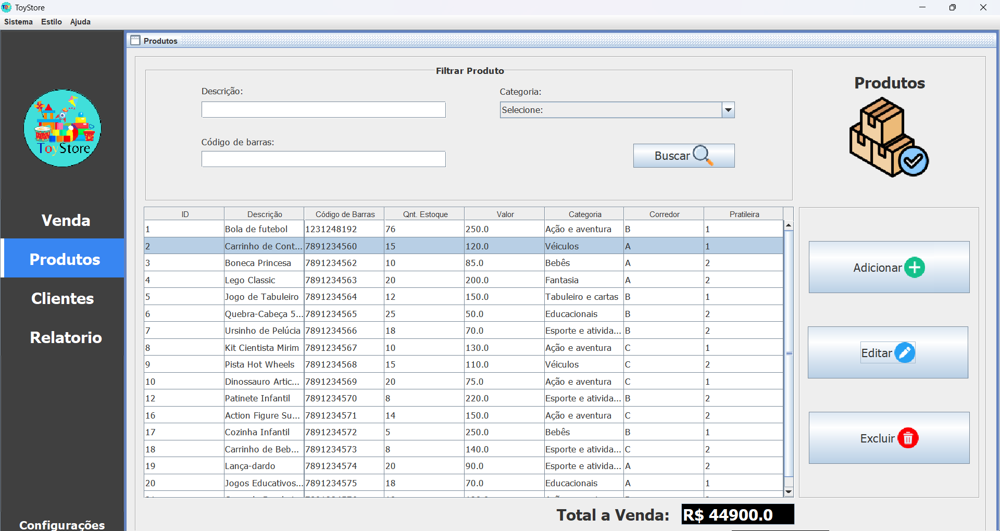

# TOYSTORE - Sistema de PDV

## 🎮 Visão Geral

O **TOYSTORE** é um sistema de ponto de venda (PDV) desenvolvido com **Java Swing**, utilizando a arquitetura **DAO** e banco de dados **MySQL**. Ele foi projetado para gerenciar vendas, controle de estoque, métodos de pagamento, leitura de código de barras e mais. 

### 🚀 Funcionalidades
- **Login de Vendedor**: Acesso restrito com autenticação de vendedor.
- **Ponto de Venda**: Realize vendas com controle de estoque e cálculo de valores.
- **Cadastro de Produtos**: Gerenciamento de produtos (inserir, editar, excluir).
- **Relatório de Vendas**: Visualização de vendas por período, com detalhes das transações.
- **Controle de Estoque**: Atualização de estoque após cada venda.
- **Métodos de Pagamento**: Pagamento em dinheiro, cartão e outras formas.
- **Leitura de Código de Barras**: Acelerando o processo de venda.

### 🖼️ Imagens das Telas do Sistema

#### Tela de Cadastro de Produtos


#### Tela de Finalização de Pagamento


#### Tela de Produtos


#### Relatório de Vendas


#### Tela de Clientes


#### Tela de Venda


#### Tela de Relatórios


## 🛠️ Tecnologias Utilizadas

- **Java Swing**: Framework para criação da interface gráfica.
- **MySQL**: Banco de dados para armazenamento de informações de produtos, vendas, etc.
- **Arquitetura DAO**: Organização de código com design pattern para acesso a dados.

## 👨‍💻 Equipe de Desenvolvimento

- **Eliseu**: Tela de Login e Cadastro de Operadores
- **Alexandro**: Ponto de Venda
- **Arthur**: Cadastro de Produtos e Clientes (CRUD)
- **Kayke**: Relatório de Vendas

## 📦 Como Executar o Projeto

1. **Clone o Repositório**
   ```bash
   git clone https://github.com/arthurberdusco/projeto-integrado-ii.git
  
